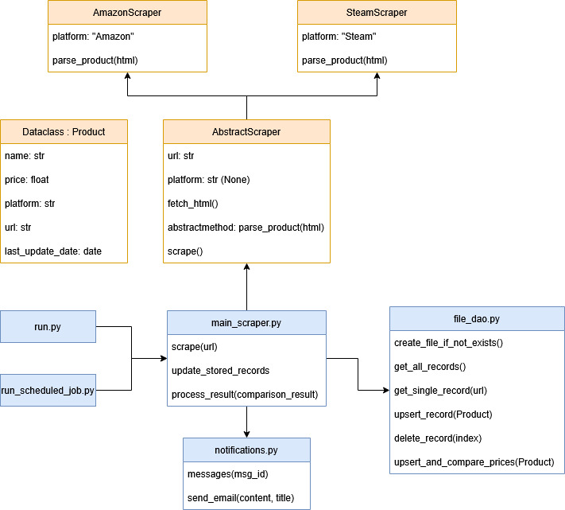

# price-alerts

**price-alerts** es una herramienta de seguimiento de precios para productos de Amazon y Steam (por ahora). Te notifica por correo electrónico cuando un artículo baja o sube de precio, permitiéndote aprovechar las mejores ofertas sin tener que comprobar constantemente los precios.

---

## Características

- Soporte para productos de Amazon y Steam, aunque gracias a la modularidad del código se pueden añadir más
- Detecta **cambios de precio** y envía automáticamente **notificaciones por correo**
- **Almacenamiento** de los datos en un archivo `.csv` local, sin necesidad de base de datos
- **Web scraping** con `BeautifulSoup`
- **Ejecuciones programadas** del proceso con `Schedule`
- Pruebas de código con **pytest** y **unittest**

---

## Estructura del proyecto

```
price-alerts/
│
├── scraper/
│   ├── main_scraper.py         # Lógica principal
│   └── platforms/              # Scrapers específicos
│       ├── amazon_scraper.py
│       └── steam_scraper.py
│
├── utils/
│   ├── file_dao.py             # Gestión del archivo .csv
│   └── notifications.py        # Envío de correos
│
├── .env                       
├── .gitignore
├── requirements.txt
├── run.py                      # Script de entrada
└── run_scheduled_job.py        # Script de ejecución de job automático
```
---

## Diagrama del sistema



---

## Instalación

1. **Clona el repositorio**

```bash
git clone https://github.com/CarlosBM00/price-alerts.git
cd price-alerts
```

2. **Instala las dependencias**

```bash
pip install -r requirements.txt
```

---

## Configuración

Crea un archivo `.env` en la raíz del proyecto con las siguientes variables:

```
EMAIL=correo_origen@gmail.com
APP_PASSWORD=contraseña_del_correo_que_manda_emails
CORREO_DEST=correo_destino@gmail.com
```

> `APP_PASSWORD` debe ser una contraseña de aplicación generada desde tu cuenta de Gmail o equivalente.

---

## Uso

Ejecuta el script principal con la URL del producto:

```python
# run.py

from scraper.main_scraper import scrape

url = "https://www.amazon.es/dp/../..."
scrape(url)

url = "https://store.steampowered.com/app/../..."
scrape(url)
```

---

## Notificaciones
Las notificaciones cuando el precio es el mismo o sube están desactivadas, puedes descomentar el código si quieres recibirlas

Si el precio cambia, recibirás un correo como este:

```
Ha BAJADO el precio de Ratón Logitech.
Precio actual: 29.99€. Precio anterior: 35.00 €
Enlace al producto: https://www.amazon.es/dp/B0BXQ1VJSS
```

---

## Licencia

MIT License. Puedes usar, modificar y compartir libremente este proyecto.

---

## Autor

Proyecto creado por [CarlosBM00](https://github.com/CarlosBM00) (en desarrollo intermitente)

---
